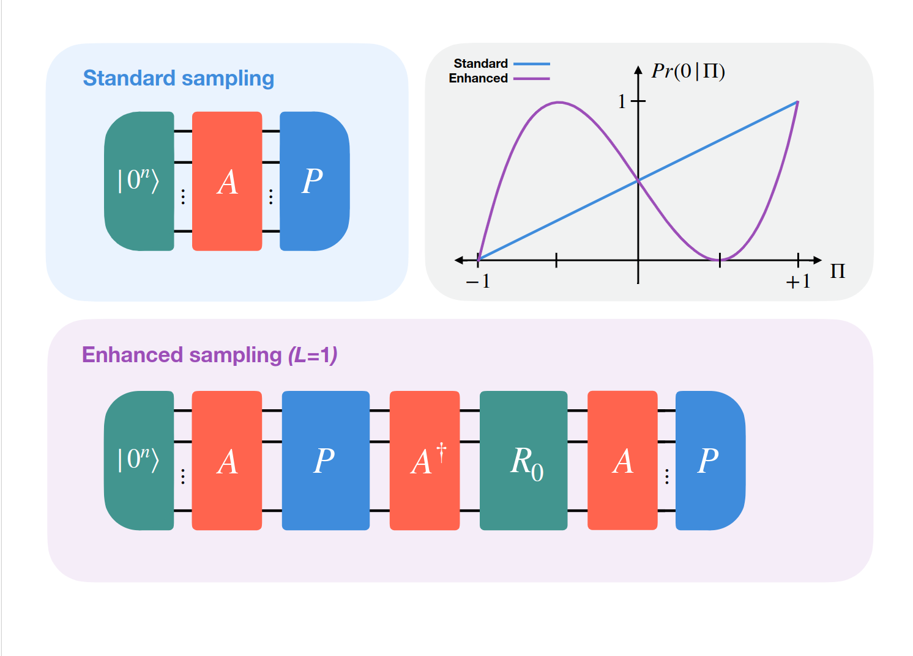

# NEASQC repo Variational Algorithms

This repository collects Python scripts and Jupyter notebooks that allow the user to test different methods for quantum computing. 
It contains our custom functions (e.g. VHA ansatz, PBO Hamiltonian) that are built upon Qiskit libraries, as well as method to reduce number of measurement and noise.

The repository is organized as follows:
- **misc**:  contains the notebooks and python scripts that showcase the variational algorithms as well as enhanced sampling method.
- **qiskit_mod**: contains our custom functions that are built upon Qiskit libraries as well as the QLM custom junction and helpers:
    - **qiskit_nat**: the customize function built upon qiskit_nature
    - **qiskit_ter**: the customize function built upon qiskit_terra
    - *my_junction.py*: the QLM custom junction used to run the variational algorithms with QLM backends
    - *uploader_junction.py*: helper to upload the junction to the QLMaaS server so that it can be found in the remote library
    - *wrapper2myqlm.py*: helper to wrap the variational algorithms using QLM stack
- **tests**: unit tests for the variational algorithms
- **enhanced_sampling**: contains the class for Enhanced Sampling: a sampling methods that uses Bayesian inference to reduce the number of measurement
- **n-rep_projection** : contains the method and an example for an algorithm to reduces quantum computation noise via constrained projections of density matrices.
- **QLMtools**: additional tools to upload qiskit_mod to the QLMaaS server
    - *uploader_library.py*: helper to upload the qiskit_mod library to the QLMaaS server
- *create_conda_env.sh*: script to create a Conda environment with all required libraries
- *environment.yml*: Conda environment file
- *setup.py*: setup file to install the qiskit_mod library and with unit test recipe to run the unit tests
- **classic_shadows**: a method derived from [Algorithmic Shadow Spectroscopy](https://arxiv.org/abs/2212.11036) for estimating energy gaps using few shots and no ancilla qubits.
    - `TMB_Example_compact` is a notebook showcasing the method on a prepared quantum program (`quantum_program.json`). It uses only open-source libraries, specified in the notebook.
    - `create_quantum_program.py` is the script creating the quantum program, but in order to run it the user need a free-license from `https://cloud.quantumsimulations.de/` to use the NoiseApp and Struqture.
    - `qoqo_shadows` is the local python file that contains helper function built on top of qoqo library to run the classic shadow method.
## Licence
The `LICENCE` file contains the default licence statement as specified in the proposal and partner agreement.

## Building and installing

To run the code in the repo a setup to build the Conda environment is provided. 
It installs python 3.9, openfermions, openfermionpyscf, qiskit libraries, and our two qiskit mods on top of the following library: qiskit-nature and qiskit-terra.
These two repos are modified to include additional functionalities not present in the standard qiskit libraries.
Additionally, the Conda environment installs QLM libraries necessary to use QLM QPUs as backends.

To install the Conda environment and our qiskit_mod library, run the following command:
```bash
source create_conda_env.sh
```
Note: for classic shadows the example notebook provide the list of libraries to install.
## Running the code
You can find the Jupyter notebook and python scripts in the **misc** folder.
Use the Conda environment provided to run the code.


## Enhanced Sampling
In this repo, we're exploring the simulation of quantum circuits using enhanced sampling methods that uses Bayesian inference to reduce the number of measurement, the algorithm is taken from [Minimizing estimation runtime on noisy quantum computers](https://arxiv.org/abs/2006.09350). The goal is to estimate the expectation values of a Hamiltonian operator on a given quantum state, which is a common task in many quantum algorithms.

We implement the non-adaptive version of the algorithm outlined in the paper to carry out Bayesian inference. The reasoning for the using the non-adaptive is to have a much faster algorithm where the parameters of the ansatz circuit are not-updated at every shot.

In the folder misc/notebook/ one can find an example of the algorithm in the notebook EnhancedSamplingExample.ipynb. In it, a generic hamiltonian is built to be used to compare the energy evaluation on a SU2 ansatz using the algorithm outlined (enhanced sampling) vs the more traditional approac (frequentist).




## N-rep projection
In the repo we include an algorithm designed to mitigate the impact of decoherence and shot noise in quantum computations carried out on Noisy Intermediate-Scale Quantum (NISQ) devices.
The algorithm utilizes the Reduced Density Matrices (RDMs) of the system, which are typically distorted by noise, and projects them into a constrained space where they preserve specific conditions: having a fixed trace (corresponding to the number of electrons/holes in the system) and being positive semi-definite.

The energy of the system, given by the expectation value of the Hamiltonian, is calculated using one- and two-electron integrals, the energy offset, as well as one- and two-particle RDMs. The algorithm considers that due to decoherence, the computed energy is likely higher than the actual ground state energy.

To resolve this, the algorithm projects RDMs into the closest space adhering to the conditions mentioned above. These projections can be done not just in the particle sector but also in the hole and particle-hole sectors, using one- and two-hole RDMs or the particle-hole RDM. The algorithm performs all three types of projections and returns the one that yields the lowest energy value when transformed back into the particle sector.

For a comprehensive understanding of the physics behind the algorithm and its performance, please refer to the associated research paper: Tomislav Piskor, Florian G. Eich, Michael Marthaler, Frank K. Wilhelm, Jan-Michael Reiner,Post-processing noisy quantum computations utilizing N-representability constraints,arXiv: 2304.13401 [quant-ph] (2023). You can find it [here](https://arxiv.org/abs/2304.13401 ).


## Analyze formation of a benzene-C02.
In the folder benzene-C02, it can be found a python script that contain a function to calculate the ground state energy of a benzene + CO2 system.

## QLM interoperability explained
The code in the repository is mainly written using the Qiskit library. To be able to run the circuits onto QLM quantum processing units (QPUs), we integrated the myqlm-interop library which enables the conversion of Qiskit circuits to QLM circuits (as well as the opposite).
Additionally, the library allows wrapping QLM QPUs onto a Qiskit`s quantum instance. This allows for easy and simple integration of QPUs as backends to run the circuits. 
This feature wraps each circuit and observable into a QLM job that is submitted to either the local or remote QLM QPU.
Unfortunately, this implementation suffers from a big overhead due to the time associated with job submissions, result retrieval, and, possibly, queue waiting times.

For this reason, to minimize the overhead, we decided to use the custom plugin framework of MyQLM. In particular, we build a custom junction that is capable of handling multiple circuit runs onto a single job submission, as well as all the classical computations associated.
The same custom junction is uploaded to the QLM server to be available from the QLMaaS library when the remote connection is established.

The custom junction gets the various methods tested in the repository as input. All methods require multiple jobs to run for various circuits and the junction framework can handle them within a single submission to minimize overhead time. 
The custom junction also modifies the function to get the energy evaluation (and gradient) inside the Qiskit solver. 
The modification converts each circuit from Qiskit to MyQLM and takes care of the job submission in the QLM framework.

Overall, this Qiskit-QLM integration allows us to choose which type of backend to use, and when combined with the QLMaaS server, enables this code to run for larger problems and molecules, which would not be possible using a simple laptop.

## Classic Shadow

Shadow spectroscopy is a quantum algorithm that estimates energy differences (gaps) in a system’s Hamiltonian by analyzing the time evolution of quantum states. This method complements traditional quantum phase estimation by leveraging classical shadows—a technique involving randomized measurements—to access a large set of observables that contain information about the energy spectrum. The key advantage of shadow spectroscopy is its relatively low quantum resource demands: no auxiliary qubits are required, and it is resilient to shot noise and gate errors prevalent in NISQ devices.

In the folder `classic_shadows` a showcase implementation of this method is provided. Is based on HQS`s qoqo framework, and it is comprised of 2 parts:
- A notebook that can be run using a pre-compiled quantum program using only free opensource libraries.
- A script that create such quantum program, for which a free licences from HQS `https://cloud.quantumsimulations.de/` is needed in order to use the needed libraries: `hqs_noise_app` and `struqture`.


## Testing and continuous integration

You can run the tests with:

```bash
python setup.py test
```


## Coding conventions

In order to simplify the coding conventions, we provide a pylint.rc file in `misc/pylint.rc`.
This will allow you to easily check your naming conventions and various other aspects.
This is not a strict guidline, as pylint can be quite pedantic sometimes (but also very helpful).

A few remarks:
- pylint can be integrated in most editors (and we strongly advise you to)
- running pylint on several source files in one go can find errors such as circular imports or code duplication:

```bash
python -m pylint --rcfile=./misc/pylint.rc <my_source_dir>
```
or

```bash
pylint --rcfile=./misc/pylint.rc <my_source_dir>
```

depending on how you installed pylint.


## GitHub CI
This repository contains a GitHub Workflow file that will automatically run pytest when changes are pushed.  
Details on disabling and enabling this feature can be found [here](https://docs.github.com/en/enterprise-server@3.0/actions/managing-workflow-runs/disabling-and-enabling-a-workflow).

## Documentation
Customize the GitHub Workflow YAML file: *repo_name*/.github/workflow/sphinx\_doc.yml
There is a basic index.rst template under 'doc'. Modify it as you want.

Any modification under the folder 'doc' pushed to GitHub will trigger a rebuild of the documentation (using GitHub CI).
If the build is successful, then the resulting html documentation can be access at: https://neasqc.github.io/repo_name

Notes:
  - You can follow the build process on the 'Actions' tab below the name of the repository.
  - neasqc.github.io does not immediately update. You may need to wait a minute or two before it see the changes.

